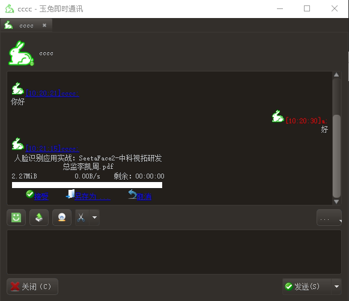
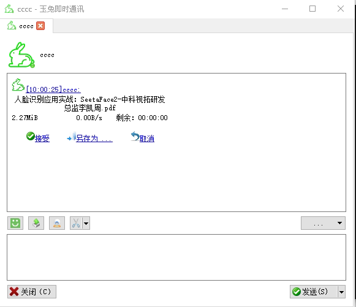
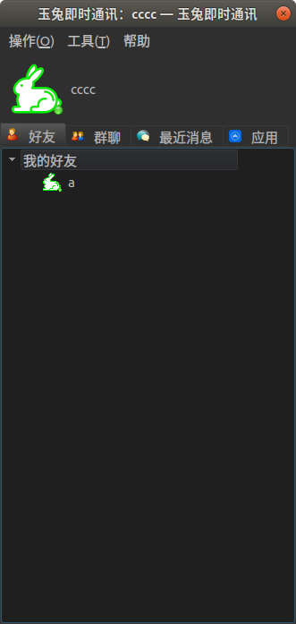
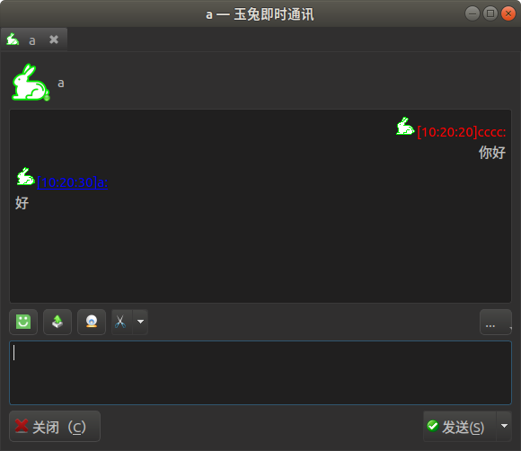
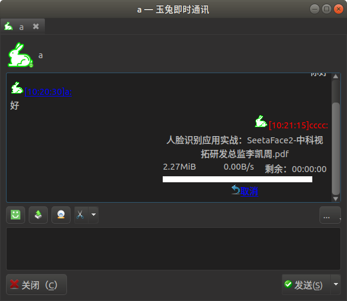

# [玉兔即时通讯](https://github.com/KangLin/rabbitim)

作者：康林 <kl222@126.com>

--------------------------------------------------------

--------------------------------------------------------

- [介绍](#介绍)
  + [功能](#功能)
- [文档](#文档)
- [自动编译状态](#自动编译状态)
- [捐赠](#捐赠)
- [下载](#下载)
- [屏幕截图](#屏幕截图)

--------------------------------------------------------

## 点赞时间线

--------------------------------------------------------

### 介绍

- [项目主页](http://kanglin.github.io/RabbitIm/)
- 项目位置
  + [项目主库位置](https://github.com/KangLin/RabbitIm): https://github.com/KangLin/RabbitIm
  + [中国镜像](https://gitee.com/kl222/RabbitIm): https://gitee.com/kl222/RabbitIm
  + [GitLab 镜像](https://gitlab.com/kl222/RabbitIm): https://gitlab.com/kl222/RabbitIm

玉兔即时通讯是一款跨操作系统平台、支持多种协议的即时通讯软件。
主要功能如下：

#### 功能:

- 通讯
  + [x] xmpp协议
    - [x] 支持点对点消息
      + [x] 文本
      + [x] 表情
      + [x] 语音（P2P）
      + [x] 视频（P2P）
      + [x] 文件传输
      + [ ] 远程桌面、远程控制
    - [x] 支持群功能（会议室功能）
      + [x] 文本
      + [x] 表情
      + [ ] 语音
      + [ ] 视频
      + [ ] 文件共享
      + [ ] 电子白板
  + [ ] [tox协议](https://github.com/irungentoo/toxcore)
- 自动更新
- 支持换肤功能
- 支持多语言
- 应用插件
    + [x] 运动
    + [x] 二维码识别、生成
    + [x] 屏幕截图
      - [x] Windows
      - [x] Unix、Linux
      - [ ] Android
    + [ ] 屏幕录像
    + [ ] 日历
    + [ ] 人脸识别
    + [ ] 支持电子白板
    + [ ] 远程桌面、远程控制
- 跨平台
  + [x] Windows
  + [x] Linux
  + [x] Android
  + [ ] MacOs
  + [ ] IOS

  由于本人没有 MacOs、IOS 设备，请有设备的同学自行编译、测试。

- 更多功能，请查看[变更日志](ChangeLog.md) [项目计划](docs/TODO.txt)

*图例：*

  - [x] 表示当前版本已经完成的功能
  - [ ] 表示将来版本将实现的功能
  
### 文档:

| 许可协议 | 变更日志 | 项目计划 | 开发 | 编译 | 开发笔记 |
|:--------:|:--------:|:--------:|:----:|:----:|:--------:|
|[许可协议](License.md)|[变更日志](ChangeLog.md)|[项目计划](TODO.txt)|[开发](docs/develop.md)|[编译](docs/INSTALL.md)|[开发笔记](docs/Books/开发笔记.md)|

### 自动编译状态

|     | master 分支 | develop 分支 |
|:---:|:-----------:|:------------:|
|Linux||
|Windows||
|Android||

### 捐赠：

本项目如果对你有用，或者你喜欢它，欢迎任何形式的捐赠（包括参与项目代码贡献或意见反馈中，以及捐赠资金等），支持作者。谢谢！

- 欢迎开发者参与本项目的开发，或意见反馈。
  + Issues: https://github.com/KangLin/RabbitIm/issues
  + 如有需要，请先提交 [Issues](https://github.com/KangLin/RabbitIm/issues)，可以为你提供必要的帮助。
- 如有咨询，请你先[捐赠资金](#捐赠资金)支持本项目。
- 本程序已提供安装包。如有仍需要本人编译程序（￥200/小时）、需要搭建整个系统、移植或定制开发（￥2000/工作日）。
  请先[付款](#捐赠资金)。非诚勿扰。

**注意**：交流时，请直奔主题，主题明确，简明扼要。

#### 捐赠资金：

如果不能显示，请打开：
- https://gitlab.com/kl222/RabbitCommon/-/raw/master/Src/Resource/image/Contribute.png
- https://sourceforge.net/p/rabbitcommon/code/ci/master/tree/Src/Resource/image/Contribute.png

### 下载：

https://github.com/KangLin/RabbitIm/releases

### 屏幕截图:

- windows 下截图:

||中文黑色样式|
|:---:|:---:|
|登录窗口||
|列表窗口||
|聊天窗口||
|文件传输||

||中文默认样式|
|:---:|:---:|
|登录窗口||
|列表窗口||
|聊天窗口||
|文件传输||

- ubuntu 下截图:

||中文黑色样式|
|:---:|:---:|
|登录窗口||
|列表窗口||
|聊天窗口||
|文件传输||
|视频||
