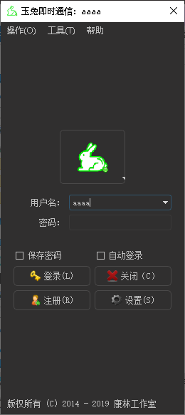
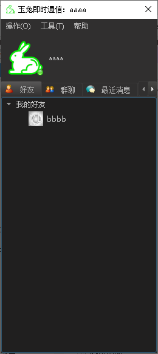
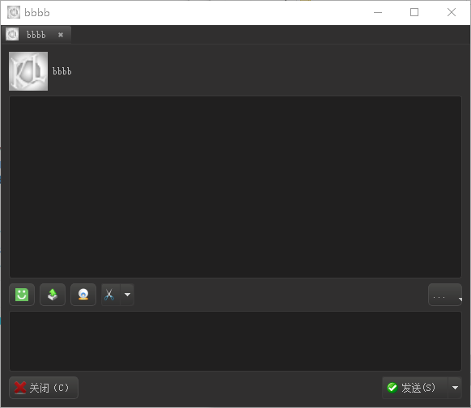
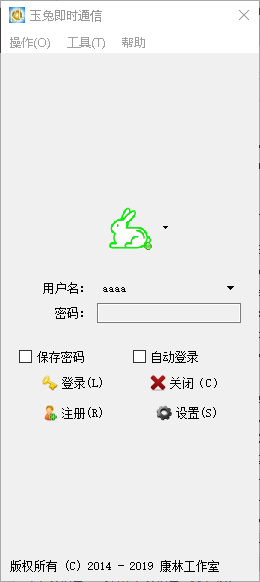
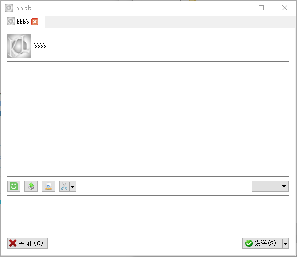
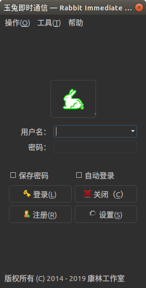
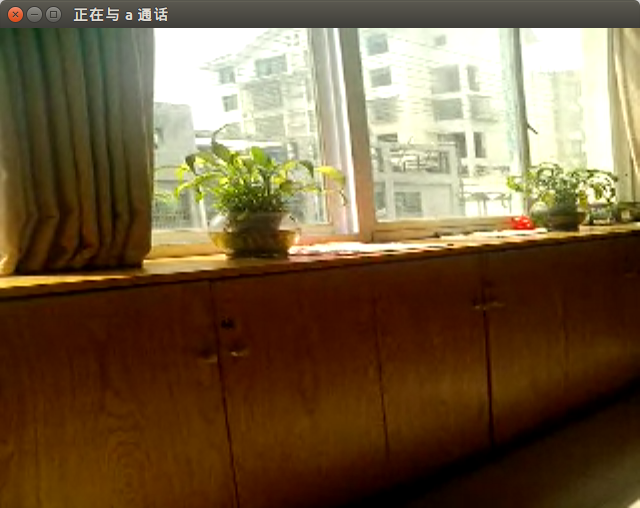

# [玉兔即时通信](https://github.com/KangLin/rabbitim)

作者：康林（Email: kl222@126.com ；QQ: 16614119)

=============================================================================

- [介绍](#介绍)
  + [功能](#功能)
- [文档](#文档)
- [自动编译状态](#自动编译状态)
- [捐赠](#捐赠)
- [下载](#下载)
- [屏幕截图](#屏幕截图)

-----------

### 介绍
 
- 作者博客：http://blog.csdn.net/kl222
- 项目位置：https://github.com/KangLin/RabbitIm  
- 项目介绍：http://blog.csdn.net/kl222/article/details/37597807   
- QQ群：68046752（本人不常上QQ）

#### 功能:

- 跨平台  
  玉兔即时通信是一款跨操作系统平台的即时通信软件,包括下列平台:
  + [x] Windows
  + [x] Linux
  + [x] Android
  + [ ] MacOs
  + [ ] IOS
  + [ ] windows phone

由于本人没有 Macos、IOS 设备，请有设备的同学自行编译、测试。

- 通信协议
  + [x] xmpp协议
    - [x] 支持点对点文本消息
    - [x] 支持群文本消息
    - [x] 支持点对点语音、视频（p2p）
    - [ ] 支持会议室功能
      + [x] 文本
      + [ ] 语音
      + [ ] 视频会议
    - [ ] 支持远程桌面、远程控制
    - [x] 支持文件传输
- [x] 支持换肤功能
- [x] 应用插件
    + [x] 运动
    + [x] 二维码识别
    + [x] 屏幕截图
    + [x] 更新
    + [ ] 支持白板

更多功能，请查看[变更日志](ChangeLog.md) [项目计划](docs/TODO.txt)

### 文档:

| 许可协议 | 变更日志 | 项目计划 | 开发 | 编译 | 开发笔记 |
|:--------:|:--------:|:--------:|:----:|:----:|:--------:|
|[许可协议](License.md)|[变更日志](ChangeLog.md)|[项目计划](docs/TODO.txt)|[开发](docs/develop.md)|[编译](docs/INSTALL.md)|[开发笔记](docs/Books/开发笔记.md)|

### 自动编译状态

|     | master 分支 | develop 分支 |
|:---:|:-----------:|:------------:|
|linux、android、mac、ios|||
|windows当前分支||

### 捐赠：

如果这个项目对您有用，我们欢迎各方任何形式的捐助，也包括参与到项目代码更新或意见反馈中来。谢谢！

#### 资金捐赠：

### 有偿服务：

1. 公司培训，技术支持，解决使用过程中出现的全部疑难问题
2. IM 系统设计、咨询
3. 搭建整个系统（包括前端、服务器）
4. 定制化开发

#### 合作联系方式:

* QQ: 16614119
* 邮箱：kl222@126.com

### 下载：

https://github.com/KangLin/RabbitIm/releases

### 屏幕截图:

- windows 下截图:

||中文黑色样式|
|:---:|:---:|
|登录窗口||
|列表窗口||
|聊天窗口||

||英语默认样式|
|:---:|:---:|
|登录窗口||
|列表窗口||
|聊天窗口||

- ubuntu 下截图:

||英文黑色样式|
|:---:|:---:|
|登录窗口||
|列表窗口||
|聊天窗口||
|视频||

||中文黑色样式|
|:---:|:---:|
|登录窗口||
|列表窗口||
|聊天窗口||
|视频||
